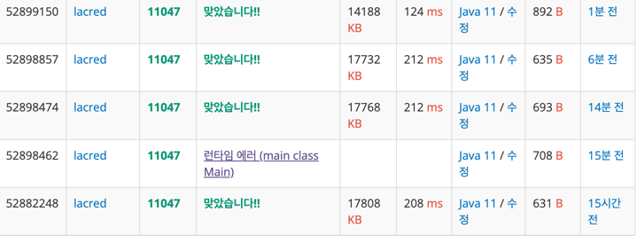
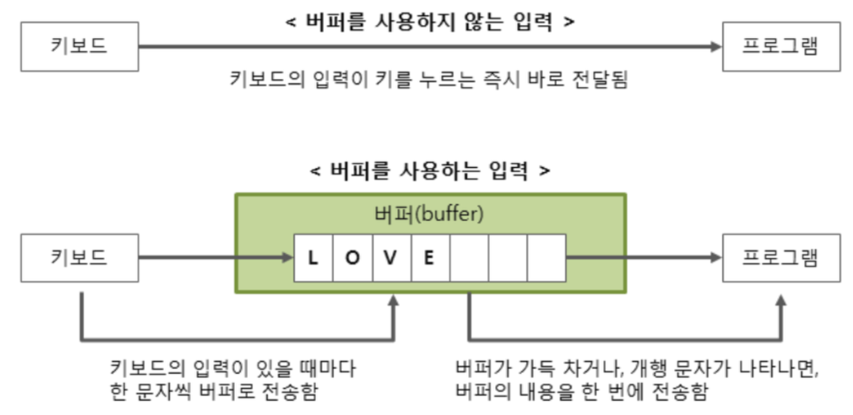

## 동전 문제

준규가 가지고 있는 동전은 총 N종류이고, 각각의 동전을 매우 많이 가지고 있다.
동전을 적절히 사용해서 그 가치의 합을 K로 만들려고 한다. 이때 필요한 동전 개수의 최솟값을 구하는 프로그램을 작성하시오.

### 제한사항 
첫째 줄에 N과 K가 주어진다. (1 ≤ N ≤ 10, 1 ≤ K ≤ 100,000,000)

둘째 줄부터 N개의 줄에 동전의 가치 Ai가 오름차순으로 주어진다. (1 ≤ Ai ≤ 1,000,000, A1 = 1, i ≥ 2인 경우에 Ai는 Ai-1의 배수)

### 출력
첫째 줄에 K원을 만드는데 필요한 동전 개수의 최솟값을 출력한다.

### 예시 결과
입력 : 10 4200 (1 5 10 50 100 500 1000 5000 10000 50000 )
결과 : 6

### 문제 구조 파악
1. N의 값을 입력 받음
2. k의 값을 입력 받음
3. n의 크기 만큼 Coin의 종류를 입력 받음
4. k의 값을 coin으로 나눔
5. coin의 개수를 파악함
6. 결과를 반환함

### 문제 풀이 

위와 같이 3가지 방법을 통해 성능을 개선하고자 하였다.
---

처음 208ms의 시간이 발생되었던 코드의 경는 다음과 같다.

    for (int i = coinKind.length; i > 0; i--) {
            result += price / coinKind[i - 1];
            price %= coinKind[i - 1];
    } 
---

208초의 시간을 조금더 단축 시켜보고자 if 조건 절을 추가하였으며
이로 인해 212ms의 시간이 발생 되었다.

    for (int i = coinKind.length; i > 0; i--) {
        if(price >= coinKind[i-1]){
            result += price / coinKind[i - 1];
            price %= coinKind[i - 1];
        }
    } 
단순하게 생각해도 위의 코드는 매번 연산을 수행하는 반면 아래의 코드는 조건을 확인하여 
조건에 해당되는 경우에 연산을 수행하면 되는 조건임에도 성능이 감소 되었다.

> 이유
>   if 조건 문을 추가 하였더라도 모든 값의 대하여 해당 조건이 맞는지 확인해야 하며 맞는 경우 추가로 연산 절차를 거치게 된다.
> 이러한 행위들로 인해 약간의 성능이 감소하게 되는 문제가 발생 되었음
---

이제 128초의 성능을 보여준 코드이다.

    BufferedReader  br = new BufferedReader(new InputStreamReader(System.in));
    StringTokenizer st = new StringTokenizer(br.readLine(), " ");
    int coinLength = Integer.parseInt(st.nextToken());
    int price = Integer.parseInt(st.nextToken());

        int[] coinKind = new int[coinLength];

        for (int i = 0; i <= coinLength - 1; i++) {
            coinKind[i] = Integer.parseInt(br.readLine());
        }

        int result = 0;

        for (int i = coinKind.length; i > 0; i--) {
            result += price / coinKind[i - 1];
            price %= coinKind[i - 1];
        }

        System.out.println(result);
    }
그동안 위의 코드는 Scanner 객체를 사용하여 입력값을 받았지만 이번에는 Buffer객체를 사용하여 입력값을 받고 있다.

> 원인  
> Buffer와 Scanner의 차이로 인해서 발생되는 문제이다.
> Scanner의 경우 1kb의 buffer를 두고 있어 사용자 입력이 들어오면 바로 프로그램에 전달된다. 
> 반면 Buffer의 경우 8kb의 buffer를 두고 있으며 InputStreamReader를 통해 사용자의 입력값을 버퍼 클래스로 가지고 있다가 한번에 전송을 하기 때문에 속도가 우월하다.
> 
> 이는 입력되는 값이 많으면 많을 수록 성능 차이를 보이게 된다.