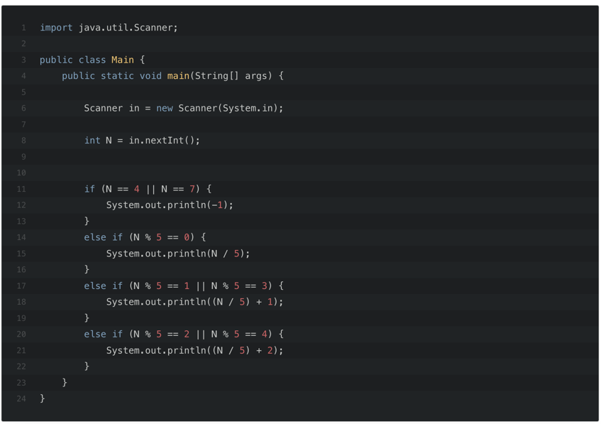

## 문제
상근이는 요즘 설탕공장에서 설탕을 배달하고 있다. 상근이는 지금 사탕가게에 설탕을 정확하게 N킬로그램을 배달해야 한다. 설탕공장에서 만드는 설탕은 봉지에 담겨져 있다. 봉지는 3킬로그램 봉지와 5킬로그램 봉지가 있다.

상근이는 귀찮기 때문에, 최대한 적은 봉지를 들고 가려고 한다. 예를 들어, 18킬로그램 설탕을 배달해야 할 때, 3킬로그램 봉지 6개를 가져가도 되지만, 5킬로그램 3개와 3킬로그램 1개를 배달하면, 더 적은 개수의 봉지를 배달할 수 있다.

상근이가 설탕을 정확하게 N킬로그램 배달해야 할 때, 봉지 몇 개를 가져가면 되는지 그 수를 구하는 프로그램을 작성하시오.

-----
## 핵심
1. N킬로그램의 배달을 정확하게 해야함
2. 설탕은 3kg, 5kg 봉지가 있음
3. 최대한 적은 수의 봉지를 사용함
4. 정확하게 N개를 만들 수 없다면 -1 반환

----
## 성능
나의 코드는 204ms의 성능을 보였다.  
그러나 다른 블로그를 참고하여 규칙을 적용한 예시는 20줄의 코드로  성능 또한 74ms로 2배이상의 차이를 보여주었다.  
결과는 다음과 같다.

---- 
## 회고
문제를 해결할 때 문제의 대한 분석을 하지 않고 접근하는 것 같다는 생각이 든다. 
규칙을 찾는 습관을 가져야 겠다.
